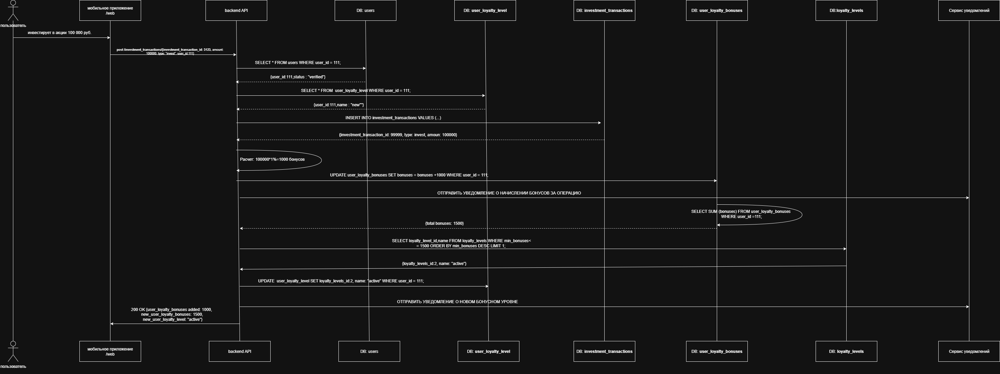
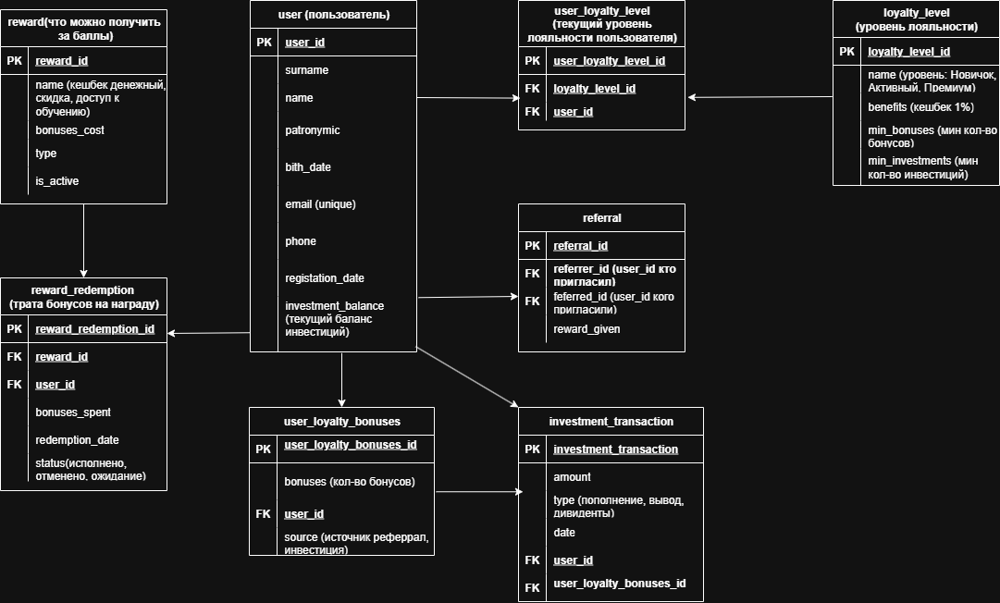

# Разработка программы лояльности для инвестиционного приложения
* [Техническое задание](https://github.com/404-veronika/testsystemanalitic/blob/main/Invest%20Capital%20Bonus.pdf)
* BPMN диаграмма процесса "Начисление баллов за инвестицию" 
* Процесс "Начисление баллов за инвестицию": 
* Проектирование Базы данных: ER диаграмма 
