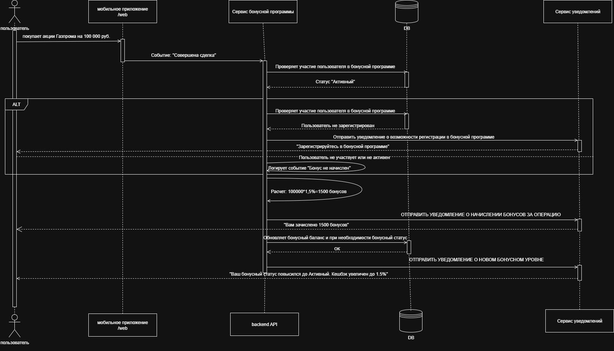
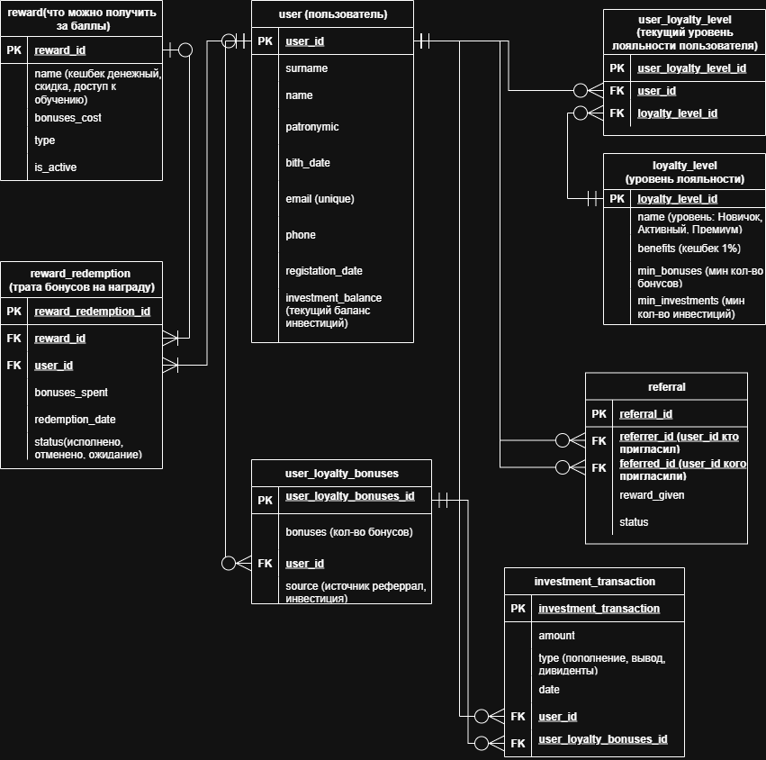

# Разработка бонусной программы лояльности для инвестиционного приложения
* [Техническое задание](https://github.com/404-veronika/testsystemanalitic/blob/main/Invest%20Capital%20Bonus.pdf)
* BPMN диаграмма процесса "Начисление баллов за инвестицию" 
* Sequence диаграмма процесса "Начисление баллов за инвестицию": 
* Спецификации [API](https://github.com/404-veronika/testsystemanalitic/tree/main/API)
* Проектирование Базы данных: ER диаграмма 
